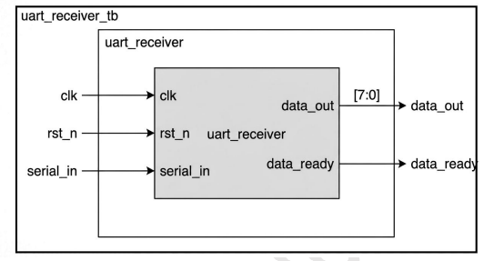
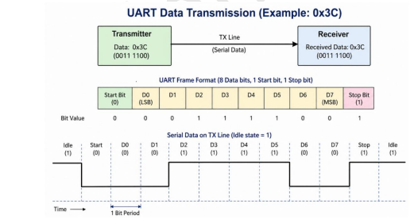
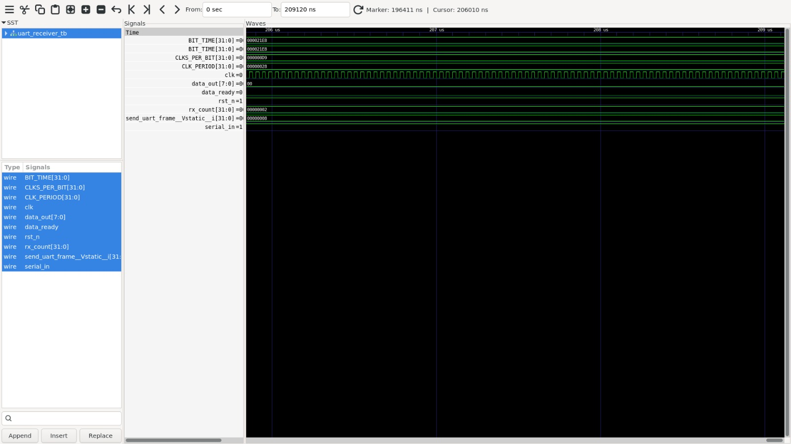

# Lab 08 – UART Receiver

## Aim

To design, simulate, and verify a UART Receiver using Verilog HDL with Verilator and visualize the received UART waveform using GTKWave.

---

# Theory

A UART (Universal Asynchronous Receiver Transmitter) Receiver is a sequential digital circuit used to receive serial data and convert it into parallel data. The receiver detects the start bit, samples each incoming data bit at the configured baud rate, verifies the stop bit, and finally outputs the received 8-bit data.

The UART receiver implemented in this lab uses a Finite State Machine (FSM) with four states:

- IDLE
- START
- RECV
- STOP

The receiver is configured for:

- System Clock : **25 MHz**
- Baud Rate : **115200 bps**
- Clock Cycles per Bit : **217**

---

# Block Diagram

<p align="center">

</p>

---

# UART Frame Format

<p align="center">

</p>

The UART frame consists of:

- 1 Start Bit
- 8 Data Bits (LSB First)
- 1 Stop Bit

---

# State Machine

| State | Description |
|--------|-------------|
| IDLE | Waits for the start bit |
| START | Validates the start bit |
| RECV | Receives all 8 data bits |
| STOP | Verifies stop bit and asserts `data_ready` |

---

# Timing Parameters

| Parameter | Value |
|-----------|-------|
| System Clock | 25 MHz |
| Clock Period | 40 ns |
| Baud Rate | 115200 bps |
| Clocks Per Bit | 217 |
| Bit Time | 8.68 μs |

---

# Project Structure

```text
Lab 08
│
├── Images
│   ├── block_diagram.png
│   ├── uart_frame.png
│   └── waveform.png
│
├── Scripts
│   └── run.sh
│
├── Source_Code
│   └── uart_receiver.v
│
├── Testbench
│   └── uart_receiver_tb.v
│
├── Waveforms
│   └── uart_receiver_tb.vcd
│
└── README.md
```

---

# RTL Design

The Verilog RTL implementation is available in:

```text
Source_Code/uart_receiver.v
```

The design uses:

- FSM-based UART receiver
- Two-stage synchronizer
- 8-bit data buffer
- Baud-rate counter
- Data Ready flag

---

# Testbench

The testbench is available in:

```text
Testbench/uart_receiver_tb.v
```

The testbench performs the following operations:

- Generates a 25 MHz clock
- Applies active-low reset
- Transmits UART frames serially
- Sends two bytes:
  - **0x3C**
  - **0x2F**
- Verifies successful reception
- Generates waveform (.vcd)

---

# Running the Simulation

A shell script is provided to automate the complete simulation flow.

The script performs the following operations:

- Compiles the RTL and testbench using Verilator
- Builds the simulation executable
- Executes the simulation
- Opens the waveform using GTKWave

The execution script is available in:

```text
Scripts/run.sh
```

Make the script executable:

```bash
chmod +x Scripts/run.sh
```

Run the simulation:

```bash
./Scripts/run.sh
```

---

# Waveform Output

<p align="center">

</p>

The waveform verifies:

- Reset operation
- Start bit detection
- Data bit sampling
- Stop bit verification
- Assertion of `data_ready`
- Correct reconstruction of received bytes

---

# Generated Waveform File

The waveform generated during simulation is available in:

```text
Waveforms/uart_receiver_tb.vcd
```

This VCD file can be viewed using GTKWave for timing analysis.

---

# Applications

- Serial Communication Systems
- Embedded Systems
- FPGA-Based UART Interfaces
- Microcontroller Communication
- Sensor Interfaces
- Wireless Communication Modules
- Debug Interfaces
- Industrial Automation

---

# Result

The UART Receiver was successfully designed in Verilog HDL, simulated using Verilator, and verified using GTKWave. The receiver correctly detected the UART start bit, sampled the incoming serial data, reconstructed the transmitted bytes, verified the stop bit, and asserted the `data_ready` signal after successful reception. The generated waveform confirmed the correct operation of the UART Receiver according to the UART communication protocol.
