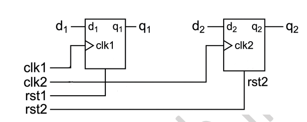
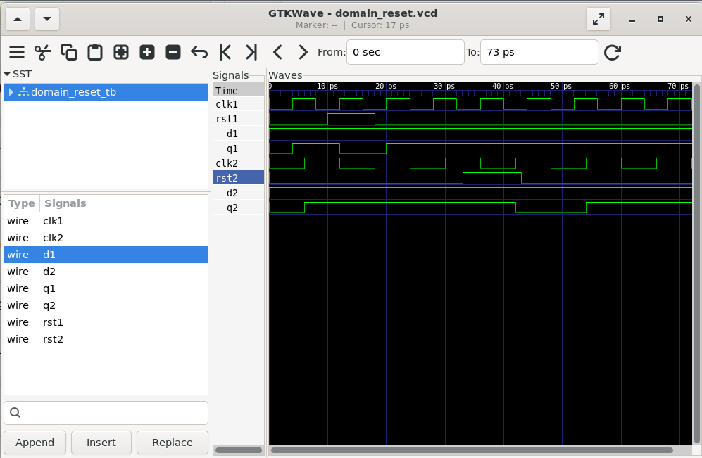

# Lab 14 – Exploring Reset Types: Foundation for RDC

## Aim

To understand and implement different reset techniques used in digital systems using Verilog HDL. This experiment demonstrates the behavior of Asynchronous Reset, Synchronous Reset, Global Reset, and Domain-Specific Reset through simulation using Verilator and GTKWave.

---

# Theory

Reset circuits are fundamental components in digital systems that initialize sequential logic into a known state during power-up, fault recovery, or system restart. Different reset methodologies are used depending on timing requirements, system architecture, and reliability considerations.

This experiment explores four commonly used reset techniques:

- Asynchronous Reset
- Synchronous Reset
- Global Reset
- Domain-Specific Reset

Understanding these reset strategies forms the foundation for **Reset Domain Crossing (RDC)** in modern FPGA and ASIC design.

---

# Folder Structure

```text
Lab 14
│
├── Asynchronous_Reset
│   ├── Images
│   ├── Scripts
│   ├── Source_Code
│   ├── Testbench
│   └── Waveforms
│
├── Synchronous_Reset
│   ├── Images
│   ├── Scripts
│   ├── Source_Code
│   ├── Testbench
│   └── Waveforms
│
├── Global_Reset
│   ├── Images
│   ├── Scripts
│   ├── Source_Code
│   ├── Testbench
│   └── Waveforms
│
├── Domain_Specific_Reset
│   ├── Images
│   ├── Scripts
│   ├── Source_Code
│   ├── Testbench
│   └── Waveforms
│
└── README.md
```

---

# Experiment 1 – Asynchronous Reset

## Description

An asynchronous reset immediately resets the flip-flop output whenever the reset signal is asserted, independent of the clock. It is commonly used for power-on initialization and emergency reset conditions.

## Block Diagram

<p align="center">

</p>

## Waveform Output

<p align="center">

</p>

### Observation

- Reset occurs immediately.
- Clock is not required.
- Output returns to zero as soon as reset is asserted.

---

# Experiment 2 – Synchronous Reset

## Description

A synchronous reset updates the flip-flop output only on the active edge of the clock. This reset technique provides predictable timing behavior and is widely used in FPGA and ASIC designs.

## Block Diagram

<p align="center">

</p>

## Waveform Output

<p align="center">

</p>

### Observation

- Reset is sampled only on the rising edge of the clock.
- Provides synchronous and predictable reset behavior.

---

# Experiment 3 – Global Reset

## Description

A global reset uses a single reset signal to initialize multiple sequential elements simultaneously during system startup.

## Block Diagram

<p align="center">

</p>

## Waveform Output

<p align="center">

</p>

### Observation

- Multiple registers are reset simultaneously.
- Suitable for complete system initialization.

---

# Experiment 4 – Domain-Specific Reset

## Description

Domain-specific reset provides independent reset signals for different clock or functional domains, allowing individual subsystems to be reset without affecting the rest of the design.

## Block Diagram

<p align="center">

</p>

## Waveform Output

<p align="center">

</p>

### Observation

- Each reset controls only its respective clock domain.
- Enables independent subsystem initialization.
- Commonly used in complex SoC architectures.

---

# Reset Comparison

| Reset Type | Clock Dependent | Scope | Typical Application |
|------------|-----------------|-------|---------------------|
| Asynchronous Reset | No | Single Module | External Reset, Power-On Reset |
| Synchronous Reset | Yes | Single Module | FPGA & ASIC Sequential Logic |
| Global Reset | Yes | Entire System | System Initialization |
| Domain-Specific Reset | Yes | Individual Clock Domain | Multi-Clock SoCs |

---

# Tools Used

- Verilog HDL
- Verilator
- GTKWave
- GVim
- Ubuntu (WSL)

---

# Applications

- FPGA Design
- ASIC Design
- System-on-Chip (SoC)
- Reset Domain Crossing (RDC)
- Clock Domain Crossing (CDC)
- Embedded Systems
- Digital Signal Processing
- Multi-Clock Digital Systems

---

# Learning Outcomes

After completing this experiment, you will be able to:

- Understand the purpose of different reset methodologies.
- Differentiate between asynchronous and synchronous reset.
- Implement global reset for system-wide initialization.
- Design independent reset circuits for multiple clock domains.
- Simulate reset circuits using Verilator.
- Analyze reset behavior using GTKWave.

---

# Result

Successfully implemented and simulated four different reset techniques using Verilog HDL. The generated waveforms verified the behavior of asynchronous, synchronous, global, and domain-specific reset circuits. This experiment demonstrates how different reset strategies are applied in FPGA, ASIC, and SoC designs to achieve reliable system initialization and robust digital operation.
